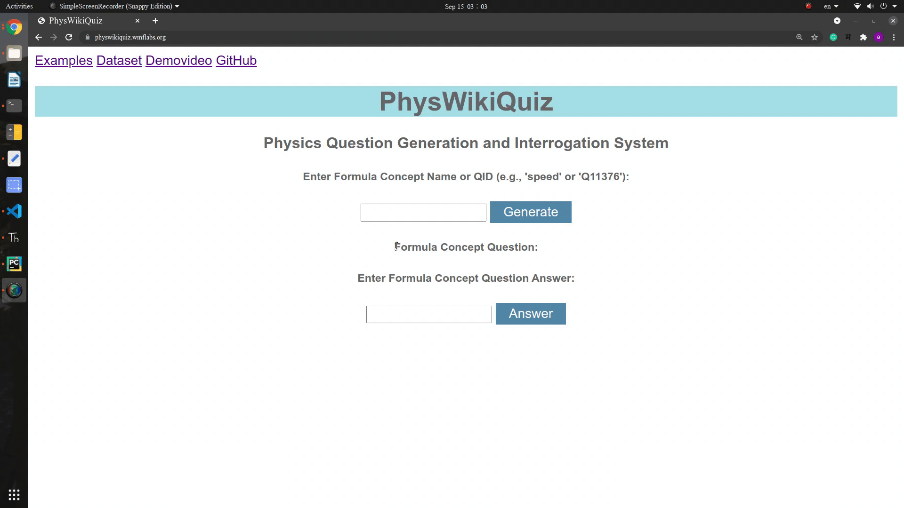
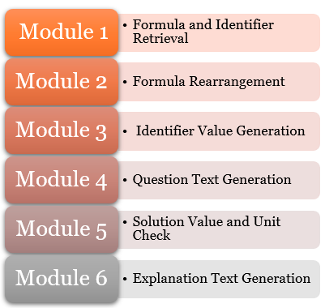
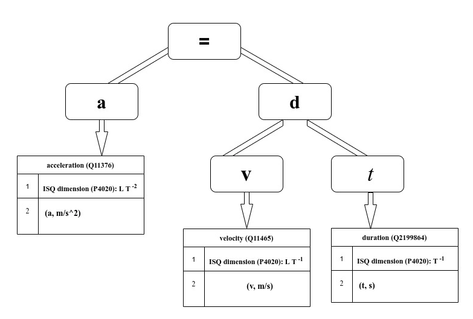

## **PhysWikiQuiz** 

**PhysWikiQuiz** is Physics Questions Generation and Interrogation System. This system can generate Physics question(s) by accepting Formula Concept Name or QID (e.g., 'speed' or 'Q11376') from the user. Every question contains comprehensive details with physical quantities, corresponding arbitrary numerical values and units. In a consecutive step, a user can input a possible answer. A system is able to check correctness of user input in terms of value and unit. In the last stage the system also generates correct explanation in the natural language. 

Required metadata for formulae is retrieved from [Wikidata](https://wikidata.org) by means of SPARQL queries and Pywikibot.

## **Motivation** 

Examination is the essential part for every student’s academic life. Large portion of any Physics examination is based upon formula based numerical examples. This system accelerates the process of examination preparation by generating large numbers of novel questions from open and continuously evolving source like Wikidata. This system is also helpful to professors and tutors to prepare question papers, which reduces their efforts and time.

## **A Quick Visit to >>PhysWikiQuiz<<** 

**PhysWikiQuiz** is a standalone web-based Physics Questions Generation and Interrogation System, implemented with Flask, the micro web framework written in Python. In this system, the user can input an identifier name or [QID](https://www.wikidata.org/wiki/Q43649390) and be able to generate question. Consecutively user can able to enter solution value and unit.

* Demo of PhysWikiQuiz


* You can quickly check system hosted at (https://physwikiquiz.wmflabs.org/).

* Video demonstration of [PhysWikiQuiz](https://youtu.be/NLX7x7JwZ_8). (By clicking you will redirects to external link hosted on Youtube)

## Dependencies
```
Python >= 3.8
```
### Flask
Flask is the web framework middleware used as an interface between the frontend and the backend.
```
$ pip3 install Flask
```
### Requests
Requests allows you to send HTTP/1.1 requests extremely easily. There’s no need to manually add query strings to your URLs, or to form-encode your `PUT` & `POST` data.
```
$ pip3 install requests
```
### Pywikibot
Pywikibot `version 5.6.0`is used to extract the formula concept data from Wikidata: https://tools.wmflabs.org/pywikibot
```
$ pip3 install pywikibot
```
### SPARQLWrapper
**SPARQLWrapper** is a simple Python wrapper around a [`SPARQL`](https://www.w3.org/TR/sparql11-overview) `version 1.8.2` service to remotely execute your queries. It helps in creating the query invokation and, possibly, convert the result into a more manageable format.
```
$ pip3 install sparqlwrapper
```
### Sympy
The computer Algebra System (CAS) Sympy is used for the calculation module to get result values given a retrieved formula and user inputs for the variables. `version 1.7.1`
```
$ apt-get install python3-sympy
```

### Latex2Sympy 
Used to convert variants of LaTeX formula strings to Sympy equivalent form. `version 1.6.2`
1) ANTLR is used to generate the parser:
```
$ sudo apt-get install antlr4
```
2) Download latex2sympy from https://github.com/augustt198/latex2sympy

### pandas 
pandas `version 1.2.1` is a fast, powerful, flexible and easy to use open source data analysis and manipulation tool,
built on top of the Python programming language.
```
$ sudo pip install pandas
```
### python modules

```
import csv
import string 
import random
imports itertools
```

### **To clone or download the repository**
```
$ git clone https://github.com/ag-gipp/PhysWikiQuiz.git
```

## Features

Present “Questions Generation and Interrogation System” are confined to a limited number of questions without much flexibility. Our system could generate a large number of novel and non-repetitive questions for the same formula concept name.

## Overview of functionality of the system

* **The Following diagram represents fundamental workflow of the system.**



* **Let us learn the workflow of the system with the example of "acceleration"**.

   

```
Module 1: Formula and Identifier Retrieval​
```
 `Module1` **retrieves formula and Identifier by using wikidata properties,** 
 * `defining formula' (P2534)` $a = \dfrac{dv}{dt}$

 * `in defining formula' (P7235)` $= a$
 * `calculated from'  (P4934)​`
  
    * `'velocity' (Q11465)`
    * `'duration' (Q2199864)​`
```
Module 2 Formula Rearrangement
```
`Module 2` **performs various possible combinations of retrieved formula.** 

 * $a = \dfrac{v}{t}$
 * $t = \dfrac{v}{a}$
 * $v = a \times t$

```
Module 3 Identifier Value Generation
```
`Module 3` **generate random numerical values for unknown identifiers and perform the required mathematical operation in order to calculate the numerical value of desirable identifier.** 

 * For equations $a = \dfrac{v}{t},~~t = \dfrac{v}{a}, ~~$ and $~~v = a \times t$. We could generate two random values, perform the required mathematical operation. Then verify with user's input for correct evaluation.​

```
Module 4 Question Text Generation
```
`Module 4` **frames a well-structured question in natural language by using names and values for the unknown identifiers.** 
 * **Example**

   $\text{What is the acceleration}~a, \text{given velocity}~v = 4~\text{m~s}^{-1},~\text{duration}~t = 5 ~\text{s}~?$​
```
Module 5 Solution Value and Unit Check​
```
`Module 5` **checks the solution value and unit entered by user and displays the conclusion.**

```
Module 6 Explanation Text Generation​
```
`Module 6` **generates explanation text with correct solution value and unit for checking consistency with user input.**   

### Final stage of the system
   In the following you can final stage of the system, when it finishes all tasks.
   
   
## Code Snippets
 **In the following code snippet of** `module_outputs.py`, **which accepts the input from student/user and checks the solution value and unit,**
```python
 # STUDENT INPUT

print('Get student answer input...\n')
answer_value, answer_unit = module5.get_answer_value_and_unit(answer_input)
print(f'Answer value: {answer_value}')
print(f'Answer unit: {answer_unit}\n')

###########################################
# Module 5: Solution Value and Unit Check #
###########################################

print('Check answer value and unit...\n')
# check solution value
value_correct = module5.check_value(correct_value,answer_value)
print(f'Solution value: {correct_value}')
print(f'Answer value: {answer_value}')
if value_correct:
   print('Value answer correct!')
else:
   print('Value answer incorrect!')

print()
# check solution unit
unit_correct = module5.check_unit(correct_unit,answer_unit)
print(f'Solution unit: {correct_unit}')
print(f'Answer unit: {answer_unit}')
if unit_correct:
   print('Unit answer correct!')
else:
   print('Unit answer incorrect!')

return value_correct,unit_correct
```

## API reference

 * Wikidata: A SPARQL query to the [Wikidata Query Services API](https://query.wikidata.org) retrieves a list of [Wikidata items](https://en.wikipedia.org/wiki/Wikidata#Items).

## Authors

* Philipp Scharpf
* Moritz Schubotz

## License

This project is licensed under the Apache License 2.0.

## Acknowledgments

We thank the Wikimedia for hosting our [web-based system](https://physwikiquiz.wmflabs.org/).


