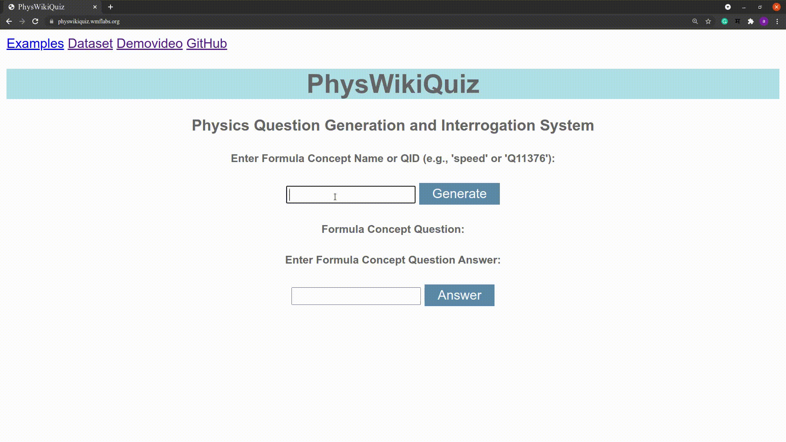
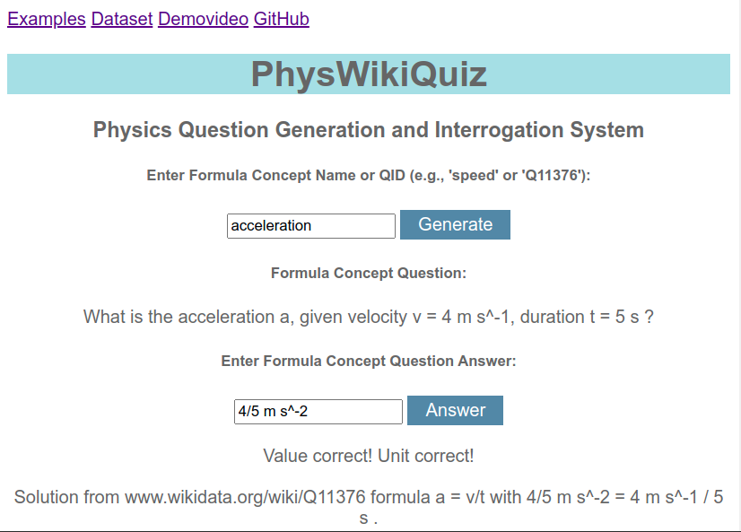

## **PhysWikiQuiz** 

**PhysWikiQuiz** is a Physics Questions Generation and Interrogation System. The system can generate Physics questions from Wikidata items, given a Formula Concept Name or QID (e.g., 'speed' or: we present PhysWikiQuiz, a Physics) user input. Each question contains comprehensive details of the involved physical quantities, and randomly generated numerical values. In a consecutive step, a student can input an possible answer. The system then checks the correctness of the user input in terms of value and unit respectively. In the last stage, the system finally generates an correct explanation of the solution, including its calculation path.. 

Required metadata for formulae is retrieved from [Wikidata](https://wikidata.org) by means of [SPARQL](https://www.w3.org/TR/rdf-sparql-query/) queries and [Pywikibot](https://www.mediawiki.org/wiki/Manual:Pywikibot).

## **Motivation** 

Examination is the essential part for every student’s academic life. A large portion of any Physics examination is based upon formula based numerical examples. This system accelerates the process of examination preparation by generating large numbers of novel questions from the open and continuously evolving source database Wikidata. The system is also helpful to professors and tutors to automatically prepare question papers, which significantly reduces their efforts and time.

## **A Quick Visit to >>PhysWikiQuiz<<** 

**PhysWikiQuiz** is a web-based Physics Questions Generation and Interrogation System, implemented with Flask, the micro web framework written in Python. 

* Demo of PhysWikiQuiz: **Speed**



* Demo of PhysWikiQuiz: **acceleration**


* You can quickly check system hosted at (https://physwikiquiz.wmflabs.org).

* Video demonstration of PhysWikiQuiz
  * [Speed](https://youtu.be/3fx_GzhBnNo) (you will be redirected to YouTube)
  * [Acceleration](https://youtu.be/PRyCT7RD_6w) (you will be redirected to YouTube)

## Dependencies

A deployed version of the system is available online, hosted by Wikimedia at https://physwikiquiz.wmflabs.org. Installing locally on your machine, the system mainly depends on the following python packages (for a full list see requirements.txt).
```
Python >= 3.8
```
### Flask
The web framework Flask version `0.12.2` is used as web framework middleware used as an interface between the frontend and the backend.
```
$ pip3 install Flask
```
### Requests
Requests `2.26.0` is an HTTP library designed to make HTTP requests simpler and more human-friendly.
```
$ pip3 install requests
```
### Pywikibot
Pywikibot `version 5.6.0`is used to extract the formula concept data from Wikidata: [https://tools.wmflabs.org/pywikibot](https://tools.wmflabs.org/pywikibot)
```
$ pip3 install pywikibot
```
### SPARQLWrapper
**SPARQLWrapper** `version 1.8.2` is a simple Python wrapper around a [`SPARQL`](https://www.w3.org/TR/sparql11-overview) service to remotely execute queries. It helps to create the query invokation and, convert the result into a more manageable format.
```
$ pip3 install sparqlwrapper
```
### Sympy
The Computer Algebra System (CAS) Sympy `version 1.7.1` is used for the calculation module to get result values given a retrieved formula and inputs for the variables. 
```
$ apt-get install python3-sympy
```

### Latex2Sympy 
LaTeX2Sympy `version 1.6.2` is used to convert variants of LaTeX formula strings to a Sympy equivalent form.

1) ANTLR is used to generate the parser:
```
$ sudo apt-get install antlr4
```
2) Download latex2sympy from [https://github.com/augustt198/latex2sympy](https://github.com/augustt198/latex2sympy)

### **To clone or download the repository**
```
$ gh repo clone https://github.com/ag-gipp/PhysWikiQuiz.git
```

## Features

The system can generate a large number of novel and non-repetitive questions for the same formula concept name.

## Overview of system functionality

* **The following diagram represents fundamental workflow of the system.**


* **Let us learn the workflow of the system with the example of "acceleration"**.

   

```
Module 1: Formula and Identifier Retrieval​
```
 `Module1` **retrieves formula and identifier information by using Wikidata properties,** 

 * `'defining formula' (P2534):` 
 * `'in defining formula' (P7235):` 
 * `'calculated from' (P4934)​:`
  
    * `'velocity' (Q11465):`
    * `'duration' (Q2199864):​`
```
Module 2 Formula Rearrangement
```
`Module 2` **generates various possible rearrangements of the retrieved formula.** 

 * 
 * 
 * 

```
Module 3 Identifier Value Generation
```
`Module 3` **generates random numerical values for unknown identifiers and performs the required mathematical operations in order to calculate the numerical value of the desired identifier.** 

 * For equations , , and , the system generates for the two respective right-hand side identifiers perform the required multiplication or division operation. The result is later compared to the user input for correctness evaluation.​

```
Module 4 Question Text Generation
```
`Module 4` **frames a well-structured question in natural language by using names and values for the occurring identifiers.** 

 * **In our example case**
   What is the acceleration a, given velocity v = 4 m s^-1, duration t = 5 s?​
```
Module 5 Solution Value and Unit Check​
```
`Module 5` **checks the solution value and unit entered by the user and displays a correctness assessment.**

```
Module 6 Explanation Text Generation​
```
`Module 6` **generates an explanation text with correct solution value and unit for the understanding of the student user.**   

### Final stage of the system
   In the following, you can see the final stage of the system, after finishing all tasks.
   

## API reference

 * Wikidata: A SPARQL query to the [Wikidata Query Services API](https://query.wikidata.org) retrieves a list of [Wikidata items](https://en.wikipedia.org/wiki/Wikidata#Items).

## Authors

* Philipp Scharpf
* Moritz Schubotz

## License

This project is licensed under the Apache License 2.0.

## Acknowledgments

We thank the Wikimedia foundation for hosting our [web-based system](https://physwikiquiz.wmflabs.org/).


